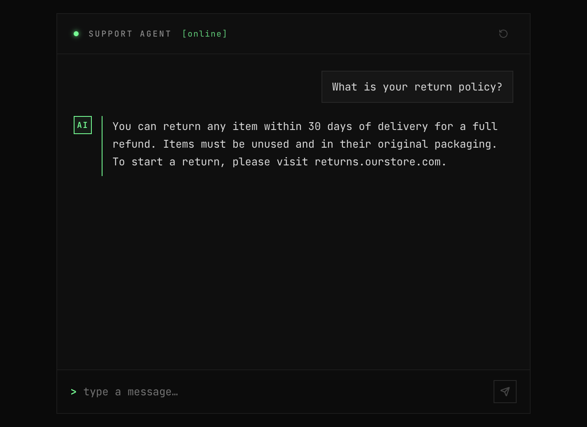

<p align="center">
  
</p>

# AI Live Chat Agent


A customer support chat widget backed by GPT-4o-mini. Users talk to the agent in a React UI; the backend stores every message in Neon PostgreSQL and pulls FAQ answers from the database into each prompt.

<p align="center">
  
</p>

Watch a full walkthrough: [demo video on Google Drive](https://drive.google.com/file/d/1RRdeg7LDpawfBY_yzCNoTY2YQZ9H6lnM/view?usp=sharing)

[Overview](#overview) · [Quick start](#quick-start) · [How it works](#how-it-works) · [API](#api) · [Configuration](#configuration) · [Limitations](#limitations)

## Overview

This repo is a small monorepo: an Express API in `backend/` and a Vite + React chat UI in `frontend/`. The agent answers questions about a fictional e-commerce store ("ourstore.com") using eight seeded FAQ entries covering shipping, returns, orders, payments, and support.

Conversations persist in Postgres. Reload the page and your thread comes back via a session ID stored in `localStorage`. Replies stream token-by-token over Server-Sent Events.

| Layer | Stack |
|---|---|
| Backend | Node.js 20, TypeScript, Express 5, OpenAI API, Prisma 7, Neon PostgreSQL |
| Security | Helmet (CSP + HSTS), express-rate-limit, Zod validation, pino logging |
| Frontend | React 19, Vite 6, Tailwind CSS v4, shadcn/ui, Zustand |

## Quick start

### Prerequisites

- Node.js 20+
- A [Neon](https://neon.tech) database (free tier is fine)
- An [OpenAI API key](https://platform.openai.com/api-keys)

### 1. Install dependencies

```bash
git clone https://github.com/gautamkumar1/ai-live-chat-agen.git && cd ai-live-chat-agen
cd backend && npm install
cd ../frontend && npm install
```

### 2. Configure the backend

```bash
cd backend
cp .env.example .env
```

Set at least these two values in `.env`:

```env
DATABASE_URL="postgresql://..."   # Neon dashboard → Connection string
OPENAI_API_KEY="sk-..."
```

### 3. Migrate and seed

```bash
cd backend
npm run db:migrate   # creates tables
npm run db:seed      # loads 8 FAQ entries across 5 categories
```

### 4. Run both servers

Use two terminals:

```bash
# Terminal 1 — backend on :3001
cd backend && npm run dev

# Terminal 2 — frontend on :5173
cd frontend && npm run dev
```

Open [http://localhost:5173](http://localhost:5173). Vite proxies `/api` to the backend, so you do not need extra CORS setup locally.

> [!NOTE]
> The backend validates all environment variables at startup with Zod. If something is missing or malformed, it exits immediately. Check the console output when the server refuses to start.

> [!TIP]
> Run `npm run db:studio` in `backend/` to browse conversations and knowledge entries in Prisma Studio.

## How it works

```
ai-live-chat-agent/
├── backend/
│   ├── prisma/
│   │   ├── schema.prisma        # conversations, messages, knowledge_entries
│   │   └── seed.ts              # 8 FAQ entries
│   └── src/
│       ├── config/env.ts        # Zod-validated env vars
│       ├── db/client.ts         # Prisma singleton (PrismaPg adapter)
│       ├── services/
│       │   ├── chat.service.ts  # OpenAI calls, persistence, error mapping
│       │   └── knowledge.service.ts  # FAQ → prompt context
│       ├── routes/chat.router.ts     # POST /chat/message · POST /chat/stream · GET /chat/:sessionId
│       └── middleware/          # validation · rate limiter · error handler
└── frontend/
    └── src/
        ├── components/          # ChatWidget, MessageList, MessageBubble, ChatInput, TypingIndicator
        ├── store/chat.store.ts  # Zustand; sessionId persisted to localStorage
        ├── hooks/useChat.ts     # streaming, optimistic updates, session restore
        └── lib/api.ts           # typed fetch wrapper
```

**Send a message:** `ChatInput` → `useChat.send()` → `POST /chat/stream` → `chat.service.generateReplyStream()` loads FAQ context from the DB, builds the message array with recent history, streams tokens from OpenAI, saves the full reply, returns `{ done, sessionId }`.

**Reload the page:** `useChat` reads `sessionId` from localStorage after Zustand rehydrates, then calls `GET /chat/:sessionId` to restore the thread.

The non-streaming `POST /chat/message` endpoint still exists if you want a single JSON response instead of SSE.

## API

| Method | Path | Body / params | Response |
|---|---|---|---|
| `POST` | `/chat/message` | `{ message, sessionId? }` | `{ reply, sessionId }` |
| `POST` | `/chat/stream` | `{ message, sessionId? }` | SSE: `{ token }` chunks, then `{ done, sessionId }` |
| `GET` | `/chat/:sessionId` | — | `{ id, createdAt, messages[] }` |
| `GET` | `/health` | — | `{ status: "ok" }` |

`/chat/stream` uses `text/event-stream`. Each event is a JSON object: `{ token: string }` while generating, then `{ done: true, sessionId: string }` when finished. On error: `{ error: string }`.

All non-SSE errors return `{ error: string }`. Raw OpenAI error text never reaches the client.

Example:

```bash
curl -X POST http://localhost:3001/chat/message \
  -H "Content-Type: application/json" \
  -d '{"message": "What is your return policy?"}'
```

## Configuration

| Variable | Default | Description |
|---|---|---|
| `DATABASE_URL` | — | Neon PostgreSQL connection string |
| `OPENAI_API_KEY` | — | OpenAI secret key |
| `PORT` | `3001` | HTTP port |
| `NODE_ENV` | `development` | `development` or `production` |
| `FRONTEND_URL` | `http://localhost:5173` | CORS allowed origin |
| `RATE_LIMIT_MAX` | `30` | Max requests per window per IP |
| `RATE_LIMIT_WINDOW_MS` | `60000` | Rate limit window (ms) |
| `MAX_MESSAGE_LENGTH` | `2000` | Character cap (enforced on backend and frontend) |
| `MAX_HISTORY_MESSAGES` | `20` | Conversation turns sent to OpenAI per request |

### LLM behavior

- Model: `gpt-4o-mini`
- System prompt: base support instructions plus all FAQ entries from `knowledge_entries`, grouped by category, loaded at request time
- Context: last 20 messages in the conversation
- Parameters: `max_tokens: 512`, `temperature: 0.4`
- Errors: OpenAI 401 → 502, rate limit → 429, timeout → 504; each mapped to a safe user-facing message

## Limitations

These are deliberate choices for a demo, not oversights.

**No authentication.** Sessions are a CUID in `localStorage`. Anyone with the ID can read the conversation. Production would need real auth.

**In-memory rate limiting.** `express-rate-limit` keeps counters in process memory. Multiple backend instances need a shared store (Redis, for example).

**Full-prompt FAQ injection.** Eight entries fit easily in the system prompt. A larger knowledge base would need retrieval (pgvector or similar) instead of dumping everything in.

**Prisma 7 driver adapter.** The client must go through the singleton at `backend/src/db/client.ts` using `PrismaPg`. The schema `datasource` block has no `url` field; the connection string lives in `prisma.config.ts`.

## Troubleshooting

**Backend exits on startup**
Check that `DATABASE_URL` and `OPENAI_API_KEY` are set and valid. The Zod schema in `backend/src/config/env.ts` prints which field failed.

**"Conversation not found" after reload**
The session ID in localStorage may point to a deleted row, or the database was reset without clearing browser storage. Hit the reset button in the chat header or clear site data for localhost.

**Stream stalls or shows no tokens**
Confirm the backend is running on port 3001 and the Vite proxy is active. SSE responses disable buffering (`X-Accel-Buffering: no`); reverse proxies in front of the API need the same setting.

**OpenAI 502 / 429 / 504**
The API key may be invalid or expired (502), you may have hit OpenAI rate limits (429), or the upstream call timed out (504). Check backend logs via pino for the underlying cause.
